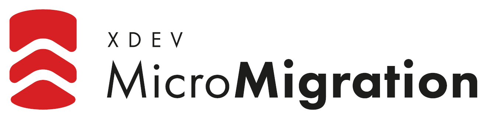
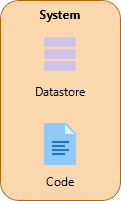
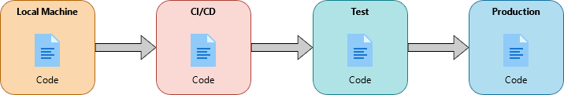
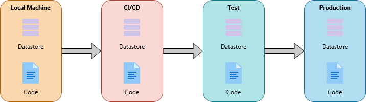
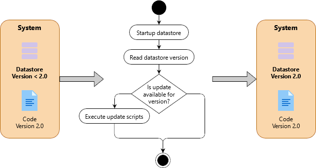

[](https://mvnrepository.com/artifact/software.xdev/micro-migration)
[](https://github.com/xdev-software/micro-migration/actions/workflows/checkBuild.yml?query=branch%3Adevelop)
[](https://sonarcloud.io/dashboard?id=xdev-software_micro-migration)

# 
Tiny java library to migrate EclipseStore datastores. 
Applies migration scripts on the datastores to keep them up to date.

## Intro
When you think about default database setup, you probably imagine something like this:



Yet in reality most workflows involve different systems like test systems and production systems. 
In code this workflow is represented with version-control systems and different branches.



For this code workflow to behave correctly, for each system a separate datastore is needed.
To keep these datastores to represent the correspondend data for the code is a hassle.



That's why migration frameworks like [Flyway](https://flywaydb.org) and [Liquibase](https://www.liquibase.org/) exist.
Unfortunately both these frameworks are designed to support any type of SQL databases but no NoSQL databases like [MicroStream](https://microstream.one/) / [EclipseStore](https://eclipsestore.io/). This led to the creation of this library.

This library delivers an easy concept to keep your MicroStream / EclipseStore datastore versioned with migration scripts written in plain java.
It's easy to create code, that automatically brings a datastore with an older version to the version, suited to the current code.



## Approaches
There are two possible usages with the Micro migration library:

The **first**, easier approach is to use the `MigrationEmbeddedStorageManager`.
It can be used on a brand new datastore or introduced later, after a MicroStream/EclipseStore datastore is already in use.
Only the storage manager (`MigrationEmbeddedStorageManager`) knows about the versioning. 
The rest of application does not know about the version and can have no regards about it.

### MigrationEmbeddedStorageManager
Extensive examples can be found in its own [own module](./micro-migration-demo).
A simple example where scripts need to be registered in the `ExplicitMigrater`:

```java
public static void main(String[] args){
	ExplicitMigrater migrater = new ExplicitMigrater(new UpdateToV1_0());
	MigrationEmbeddedStorageManager storageManager = MigrationEmbeddedStorage.start(migrater);
	// Do some business logic
	storageManager.shutdown();
}
```

The update scripts can look like this:

```java
public class UpdateToV1_0 implements MigrationScript<Object>
{
	@Override
	public MigrationVersion getTargetVersion(){
		return new MigrationVersion(1);
	}
	
	@Override
	public void migrate(Context<String, EmbeddedStorageManager> context){
		// Logic of the update
		context.getStorageManager().setRoot("Update 1.0");
	}
}
```

### MigrationManager
Although the approach with the `MigrationEmbeddedStorageManager` is pretty easy to handle, it is intrusive in the way, that it replaces the root entry point of the MicroStream/EclipseStore datastore and inserts its own `VersionedRoot` as root. Some users might find this too entrusive.

That's why a second approach can be used, where the `MigrationManager` is used. This class is also used internally by the `MigrationEmbeddedStorageManager`. 

```java
public static void main(String[] args){
	ExplicitMigrater migrater = new ExplicitMigrater(new UpdateToV1_0());
	EmbeddedStorageManager storageManager = EmbeddedStorage.start();
		VersionedObject<Object> versionedRoot =(VersionedObject<Object>)storageManager.root();
		new MigrationManager(versionedRoot, migrater, storageManager).migrate(versionedBranch);
	// Do some business logic
	storageManager.shutdown();
}
```

## Migrater
### ExplicitMigrater
Scripts for the migrations must be registered in a `MicroMigrater`. 
The simplest way for this is to use the `ExplicitMigrater` and just put the scripts in the constructor.
A downside of this method is that you need to register all scripts (new or old) manually in the constructor.

```java
final ExplicitMigrater migrater = new ExplicitMigrater(
	new UpdateToV1_0(),
	new UpdateToV1_1()
);
```

### ReflectiveMigrater
For a more convenient usage the `ReflectiveMigrater` was built. 
You simply instanciate a object of this class with the package name of your `MicroMigrationScript`s.
The `ReflectiveMigrater` will search for any implementations of `MicroMigrationScript` in the given package.
This way scripts can simply be placed in the same package and on startup of the application all scripts are loaded in.

```java
final ReflectiveMigrater migrater = new ReflectiveMigrater("software.xdev.micromigration.examples.reflective.scripts");
```

## Installation
[Installation guide for the latest release](https://github.com/xdev-software/micro-migration/releases/latest#Installation)

### Compatibility
| Eclipse Store version | micro-migration version |
| --- | --- |
| Eclipse Store 1+ | ``2+`` |
| MicroStream 5-8<br/>Eclipse Store 1+ | ``1`` |

## Support
If you need support as soon as possible and you can't wait for any pull request, feel free to use [our support](https://xdev.software/en/services/support).

## Contributing
See the [contributing guide](./CONTRIBUTING.md) for detailed instructions on how to get started with our project.

## Dependencies and Licenses
View the [license of the current project](LICENSE) or the [summary including all dependencies](https://xdev-software.github.io/micro-migration/dependencies)
